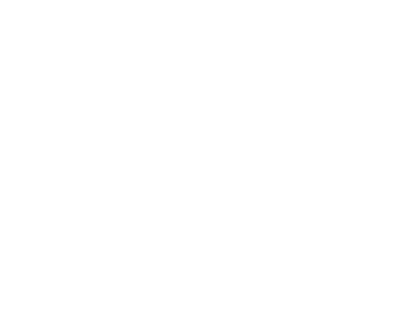
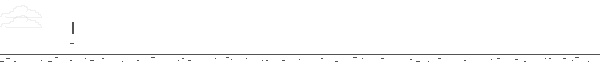
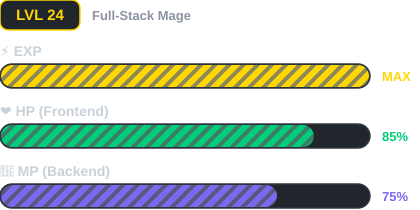

<table width="100%">
  <tr>
    <td valign="middle" width="220">
      <!-- ASCII Art Portrait -->
      
    </td>
    <td valign="middle" align="center">
      <!-- Retro Gaming Font Title — types once and stays -->
      
      <br/>
      <!-- Subtitle — cycles through lines once and stays on last line -->
      
      <br/><br/>
      <!-- Badges -->
      <a href="mailto:samananiascases@gmail.com">
        
      </a>
      <a href="https://msng.link/o/?639925731056=vi" target="_blank">
        
      </a>
      <a href="https://samananiascases.wasmer.app" target="_blank">
        
      </a>
      <br/><br/>
      <!-- Chrome Dino Animation -->
      
    </td>
  </tr>
</table>

<hr/>

<h3></h3>

<table width="100%">
<tr>
<!-- Left Column: Character Status & Base Stats -->
<td valign="top" width="40%">

<h4 align="center">👾 CHARACTER STATUS</h4>
<p align="center"><strong>Class:</strong> Apprentice Coder 🔮</p>
<hr/>

<p>💡 <strong>KNOWLEDGE</strong> &nbsp;&nbsp;&nbsp;&nbsp; <code>[▰▰▰▰▱▱▱▱▱▱] 40%</code></p>
<p>🎨 <strong>CREATIVITY</strong> &nbsp;&nbsp;&nbsp; <code>[▰▰▰▰▰▱▱▱▱▱] 50%</code></p>
<p>🤝 <strong>COLLABORATION</strong> <code>[▰▰▰▰▰▱▱▱▱▱] 50%</code></p>
<p>📚 <strong>LEARNING</strong> &nbsp;&nbsp;&nbsp;&nbsp;&nbsp; <code>[▰▰▰▰▰▰▰▰▰▰] 100%</code></p>

</td>
<!-- Right Column: Level, Vitals, Description, and Hobbies -->
<td valign="top" width="60%">



<hr/>

<strong>📜 DESCRIPTION</strong>
<p>I am a <strong>Bachelor of Industrial Technology (BIT)</strong> graduate, focusing on leveling my skill tree and unlocking a new skill set. Still too underleveled to be picking fights with high-tier enemies, just trying to survive long enough for the late game. <strong>LET IT RIDE!!</strong></p>

<strong>⚡ PASSIVES & BUFFS</strong>

<strong>🌱 [ACTIVE BUFF] — Grinding Mode</strong>
<pre>
++ EXP  Knowledge
++ EXP  Learning
++ EXP  Skills
</pre>

<strong>🛡️ [PASSIVE TRAIT] — Always Equipped</strong>
<pre>
++ DEF  Adaptability
++ DEF  Teamwork
++ LCK  Curiosity
</pre>

</td>
</tr>
</table>

<hr/>

<h3></h3>


<tr>
<td>

<p><strong>🔥 Active Quests</strong></p>
<ul>
<!--START_SECTION:active_quests-->
<li><b><a href="https://github.com/SamAnaniasCases/SamAnaniasCases">SamAnaniasCases</a></b> — Coding Information about myself</li>
<li><b><a href="https://github.com/avegabros/bits">bits</a></b> — Biometric Integrated Timekeeping System</li>
<!--END_SECTION:active_quests-->
</ul>

<p><strong>💤 Inactive Quests</strong></p>
<ul>
<!--START_SECTION:inactive_quests-->
<li><b><a href="https://github.com/SamAnaniasCases/portfolio">portfolio</a></b> — My real portfolio</li>
<li><b><a href="https://github.com/SamAnaniasCases/myPortfolio">myPortfolio</a></b> — Mi Cogito — Personal Developer Portfolio, interactive web developer portfolio. Built with PHP, vanilla CSS, and JavaScript, it is designed around warm-minimalism and high-fidelity micro-interactions.</li>
<li><b><a href="https://github.com/SamAnaniasCases/bitsFork">bitsFork</a></b> — Biometric Integrated Tracking System</li>
<!--END_SECTION:inactive_quests-->
</ul>

</td>
</tr>

<hr/>

<h3></h3>

<p><em>Abilities unlocked through countless quests and side missions.</em></p>

<table width="100%">
<tr>
<td valign="top" width="33%">

<h4 align="center">⚔️ FRONTEND BRANCH</h4>
<p align="center"><code>[ APPRENTICE ]</code></p>


<p align="center">
  
  
  
  
  
  
  
</p>

</td>
<td valign="top" width="33%">

<h4 align="center">🔮 BACKEND BRANCH</h4>
<p align="center"><code>[ APPRENTICE ]</code></p>

<p align="center">
  
  
  
  
</p>

</td>
<td valign="top" width="33%">

<h4 align="center">🛡️ DEVOPS BRANCH</h4>
<p align="center"><code>[ APPRENTICE ]</code></p>

<p align="center">
  
  
  
  
  
  
</p>

</td>
</tr>
</table>


<hr/>

<h3></h3>

<table width="100%">
<tr>
<td>

<p><em>Performance metrics gathered from the Guild's archives and the Timekeeper's logs.</em></p>

<p align="center">
  
</p>

<h4 align="center">⚔️ Combat Record</h4>

<p align="center">
  
  
</p>

<p align="center">
  
</p>

<h4 align="center">⏱️ Grind Log</h4>

<p><em>Days and hours spent sharpening skills — tracked by the Guild's Timekeeper.</em></p>

<!--START_SECTION:waka-->


**I'm a Dawn Warrior 🌅** 

```text
🌞 Morning                169 commits         ▰▰▰▰▰▰▰▰▱▱▱▱▱▱▱▱▱▱▱▱▱▱▱▱▱   32.25 % 
🌆 Daytime                242 commits         ▰▰▰▰▰▰▰▰▰▰▰▰▱▱▱▱▱▱▱▱▱▱▱▱▱   46.18 % 
🌃 Evening                105 commits         ▰▰▰▰▰▱▱▱▱▱▱▱▱▱▱▱▱▱▱▱▱▱▱▱▱   20.04 % 
🌙 Night                  8 commits           ▱▱▱▱▱▱▱▱▱▱▱▱▱▱▱▱▱▱▱▱▱▱▱▱▱   01.53 % 
```
📅 **Peak Grinding Day: Thursday** 

```text
Monday                   53 commits          ▰▰▰▱▱▱▱▱▱▱▱▱▱▱▱▱▱▱▱▱▱▱▱▱▱   10.11 % 
Tuesday                  115 commits         ▰▰▰▰▰▱▱▱▱▱▱▱▱▱▱▱▱▱▱▱▱▱▱▱▱   21.95 % 
Wednesday                67 commits          ▰▰▰▱▱▱▱▱▱▱▱▱▱▱▱▱▱▱▱▱▱▱▱▱▱   12.79 % 
Thursday                 160 commits         ▰▰▰▰▰▰▰▰▱▱▱▱▱▱▱▱▱▱▱▱▱▱▱▱▱   30.53 % 
Friday                   72 commits          ▰▰▰▱▱▱▱▱▱▱▱▱▱▱▱▱▱▱▱▱▱▱▱▱▱   13.74 % 
Saturday                 34 commits          ▰▰▱▱▱▱▱▱▱▱▱▱▱▱▱▱▱▱▱▱▱▱▱▱▱   06.49 % 
Sunday                   23 commits          ▰▱▱▱▱▱▱▱▱▱▱▱▱▱▱▱▱▱▱▱▱▱▱▱▱   04.39 % 
```


📊 **This Week's Training Log** 

```text
🕑︎ Time Zone: Asia/Manila

🔮 Spell Schools: 
TypeScript               8 hrs 9 mins        ▰▰▰▰▰▰▰▰▰▰▰▰▰▱▱▱▱▱▱▱▱▱▱▱▱   53.13 % 
Markdown                 3 hrs 1 min         ▰▰▰▰▰▱▱▱▱▱▱▱▱▱▱▱▱▱▱▱▱▱▱▱▱   19.73 % 
JSON                     1 hr 23 mins        ▰▰▱▱▱▱▱▱▱▱▱▱▱▱▱▱▱▱▱▱▱▱▱▱▱   09.02 % 
Prisma                   49 mins             ▰▱▱▱▱▱▱▱▱▱▱▱▱▱▱▱▱▱▱▱▱▱▱▱▱   05.40 % 
Other                    44 mins             ▰▱▱▱▱▱▱▱▱▱▱▱▱▱▱▱▱▱▱▱▱▱▱▱▱   04.78 % 

⚔️ Weapons of Choice: 
Antigravity IDE          15 hrs 20 mins      ▰▰▰▰▰▰▰▰▰▰▰▰▰▰▰▰▰▰▰▰▰▰▰▰▰   100.00 % 

📜 Active Quests: 
bits                     13 hrs 12 mins      ▰▰▰▰▰▰▰▰▰▰▰▰▰▰▰▰▰▰▰▰▰▰▱▱▱   86.13 % 
myPortfolio              2 hrs 7 mins        ▰▰▰▱▱▱▱▱▱▱▱▱▱▱▱▱▱▱▱▱▱▱▱▱▱   13.87 % 
Unknown Project          0 secs              ▱▱▱▱▱▱▱▱▱▱▱▱▱▱▱▱▱▱▱▱▱▱▱▱▱   00.00 % 

🛡️ Battle Platform: 
Windows                  15 hrs 20 mins      ▰▰▰▰▰▰▰▰▰▰▰▰▰▰▰▰▰▰▰▰▰▰▰▰▰   100.00 % 
```


<!--END_SECTION:waka-->

</td>
</tr>
</table>

<hr/>

<h3></h3>

<table width="100%">
<tr>
<td>

<!--START_SECTION:activity-->
1. 🎉 Merged PR [#574](https://github.com/avegabros/bits/pull/574) in [avegabros/bits](https://github.com/avegabros/bits)
2. 💪 Opened PR [#574](https://github.com/avegabros/bits/pull/574) in [avegabros/bits](https://github.com/avegabros/bits)
3. 🎉 Merged PR [#573](https://github.com/avegabros/bits/pull/573) in [avegabros/bits](https://github.com/avegabros/bits)
4. 🔒 Closed issue [#571](https://github.com/avegabros/bits/issues/571) in [avegabros/bits](https://github.com/avegabros/bits)
5. 💪 Opened PR [#573](https://github.com/avegabros/bits/pull/573) in [avegabros/bits](https://github.com/avegabros/bits)
<!--END_SECTION:activity-->

</td>
</tr>
</table>